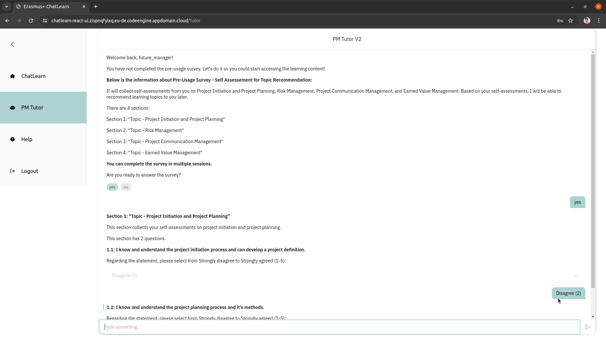
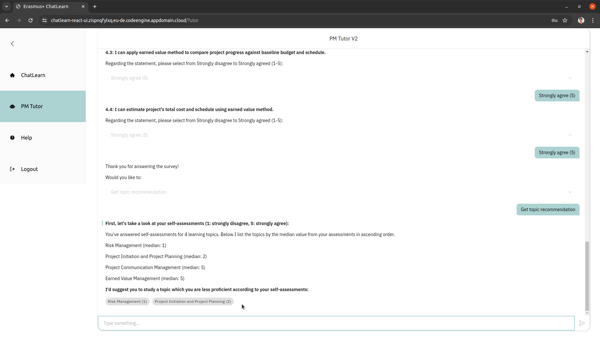
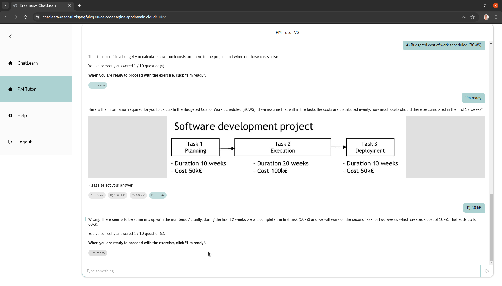
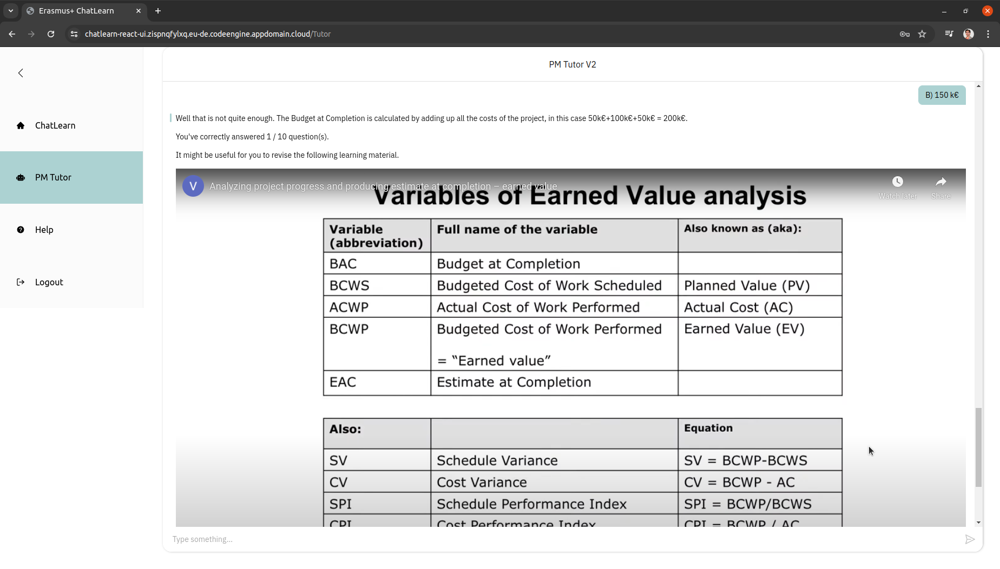
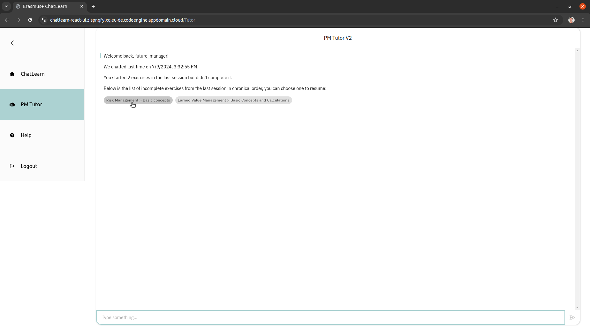
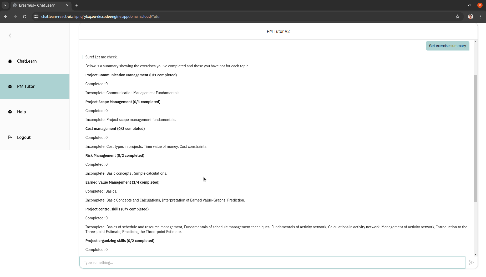
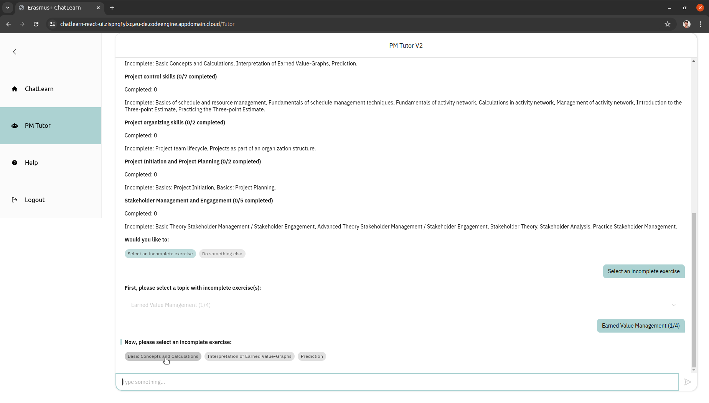
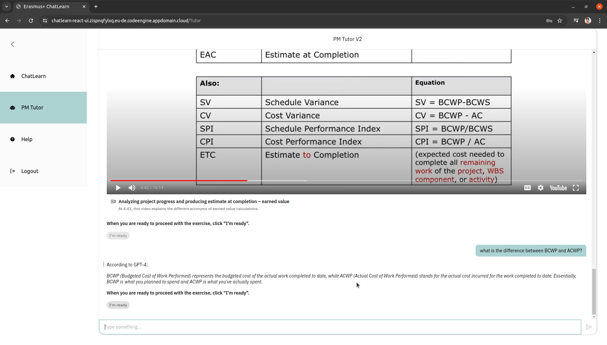
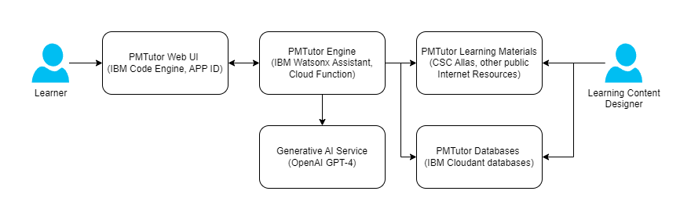

# Introduction to Erasmus+ ChatLearn PMTutor
This repository introduces PMTutor, a configurable tutoring chatbot prototype offering personalized adaptive learning features. 
It leverages rule-based and generative artificial intelligence (AI), was developed for project management training in higher education
by Erasmus+ ChatLearn project during 1.2.2022 to 31.7.2024. The project consists of members from University of Oulu (Finland), WU Vienna (Austria), 
Politecnico di Milano (Italy), and Reykjavik University (Iceland). Learn more about [Erasmus+ ChatLearn project](https://www.oulu.fi/en/projects/personalized-project-management-learning-chatbots).

Besides highlighting the features of PMTutor, this repository also introduces the main components and their corresponding repositories&mdash;so 
you can set up your own PMTutor system!

## Table of contents
- [Configurable learning content](#configurable-learning-content)
- [Personalized adaptive learning features](#personalized-adaptive-learning-features)
- [Main components](#main-components)
  - [Content layer](#content-layer)
  - [Chatbot layer](#chatbot-layer)
  - [UI layer](#ui-layer)
- [Steps for setting up your PMTutor system](#steps-for-setting-up-your-pmtutor-system)
- [License](#license)
- [References](#references)

## Configurable learning content
PMTutor was developed for project management training in higher education. Learning topics and case studies can
be configured and updated through PMTutor spreadsheet templates and content management tool set.

During the project, 9 core learning topics and 3 case studies had been configured by project management experts. 

The core learning topics include:
- Project communication management
- Project scope management
- Cost management
- Risk management
- Earned value management
- Project control skills
- Project organization skills
- Project initiation and project planning
- Stakeholder management and engagement

Case studies feature:
- PiaceRe - Piacenza Po River Regained - Promoting the enhancement of cultural heritage by consolidating ecosystem services The Project, called PiaceRe, Piacenza Po River Regained is an ambitious endeavor aimed at revitalizing and transforming the city of Piacenza urban landscape. The project's central focus lies in harnessing innovative strategies to breathe new life into the area surrounding the majestic Po River, which plays a pivotal role in the local community's cultural and economic identity.
- Wte project in Iceland: Case study with focus on risk and cost. This case study looks into building a 130,000 tn incineration plant in Helguvik, Iceland, focusing on cost-benefit analysis and risk assessment. It explores the project life-cycle, calculating the total investment cost required, a cost-benefit analysis, sensitivity analysis, risk assessment matrixes, and black swan risk events.
- Case study Dock for Change! In this case study you will learn to identify and analyse project stakeholder and define adequate measures to build the relationship to project stakeholder. Furthermore you will learn to set up initial project plans.

Learning content-related repositories are documented in the section [content management tool set](#content-management-tool-set).

## Personalized adaptive learning features
Users can ask PMTutor to recommend learning topics based on their self assessment. During an exercise, they will also
receive custom feedback based on their performance. They can request a summary of topic exercises they have done,
select or resume an incomplete exercise. Additionally, PMTutor can answer questions beyond its rule-based scope, thus
better serve the need of different learners. These features were inspired by Peng et al. (2019).

Below is a collection of screenshots showing the mentioned features.

*A new user will be invited to do a self-assessment survey*

*After completing the survey, the user can ask for topic recommendation&mdash;the recommendation will be updated based on the user's future self-assessment*

*The user receives custom feedback based on whether her answer is correct*

*The user will be suggested to check out a relevant learning material if she answers incorrectly more than once*

*The user can resume started exercises which were incomplete in the previous session*

*The user can request to see a list of completed and incomplete topic exercises*

*The user can request to select an incomplete exercise*

*For example, the user can ask question about terminologies before proceeding to the next exercise question*

Return to [table of contents](#table-of-contents)

## Main components
The figure below shows the main components of PMTutor: Document databases and cloud object storage form a content layer enabling 
PMTutor to offer project management learning content and personalized adaptive learning features. The PMTutor engine is the core 
chatbot component, augmented by webhook functions and a generative AI service. Together, they form the services of chatbot layer. Finally, a UI layer consists of 
web applications with authentication enable the tutor to recognize its users and offer personalized adaptive learning features.

The main components and their corresponding repositories are presented below by layer.
### Content layer
#### Document databases
The databases enable PMTutor offer learning content designed by subject experts; furthermore, they store some user interaction data to
facilitate personalized adaptive learning features. The databases were implemented using IBM Cloudant service.

You can find data models, instructions and Python scripts for creating required databases at [PMTutor cloudant databases](https://github.com/erasmus-chatlearn/pmtutor-cloudant-databases).

#### Content management tool set
The tool set is a collection of Python scripts for parsing and uploading learning content as well as self-assessment surveys 
for self-assessment and topic recommendation.

You can find the repository at [PMTutor content management tool set](https://github.com/erasmus-chatlearn/pmtutor-content-management).

The spreadsheet configurations of project management learning topics and case studies developed by the project are shared in 
their respective configuration folders at [Erasmus+ ChatLearn Material Bank](https://drive.google.com/drive/folders/1u6GvKGGqeYbRgt4HwSUUCB6z1oYjGXxB). 
Feel free to use them for content creation!

#### Cloud object storage
Learning materials like course slides and videos are not stored in the learning content database; instead, they are uploaded to a cloud object storage service and their public URLs are 
referenced in the configuration. Depending on the configuration, PMTutor would present pdf files as hyperlinks with short 
description or play embedded videos.

Allas service of Finnish IT Center for Science (CSC) was leveraged for storing materials as cloud objects. Every cloud object
has a public accessible URL. The URLs can be reused for configuring new learning content. Read more about [PMTutor cloud object storage](pmtutor-allas-cloud-object-storage/README.md).

### Chatbot layer
#### PMTutor webhook
Webhook enables PMTutor to leverage services like databases and process data, is essential for facilitating personalized
adaptive learning features. A Node.js Express middleware was created for this purpose.

The repository is shared at [PMTutor webhook middleware](https://github.com/erasmus-chatlearn/pmtutor-webhook).

#### PMTutor engine
IBM Watsonx Assistant was chosen before generative AI services emerged. Its natural language understanding and rule-based 
dialog logic ensured precise control over delivered content, which is crucial for domains like education.

The use cases and dialog configurations of PMTutor, and instructions for setting up a watsonx assistant instance are shared 
at [PMTutor watsonx assistant configurations](https://github.com/erasmus-chatlearn/pmtutor-watsonx-assistant-configurations).

#### Generative AI service
OpenAI GPT-3 was leveraged for answering users' open questions as soon as we learned about ChatGPT in the end of 2022, 
it was switched to GPT-4 in 2023. Generative AI has enabled PMTutor to answer questions beyond its scope. Furthermore,
GPT-4 is used in assessing user inputs for open-ended case study assignment questions.

Instructions on integrating OpenAI service to PMTutor is documented in [PMTutor watsonx assistant setup guide](https://github.com/erasmus-chatlearn/pmtutor-watsonx-assistant-configurations/blob/main/setup/setup-guide.md). 

### UI layer
#### Authentication service
IBM APP ID service was leveraged for authentication and facilitating personalized adaptive learning features. After logging in, 
a unique user identifier and username are sent to PMTutor engine. PMTutor addresses the user by the provided username and
manages interaction data using the unique identifier; subsequently, it could offer personalized adaptive learning features like 
recommending learning topics based on the user's self assessment.

Instructions for setting up APP ID service are documented in [PMTutor authentication](pmtutor-app-id-authentication/README.md).

#### Classic UI
A minimalistic UI (HTML, CSS, jQuery, and Node.js Express) was created for verifying use cases of the system and 
had served as a backup of React UI.

Here is the repository of [classic UI](https://github.com/erasmus-chatlearn/pmtutor-classic-ui).

#### React UI
Created by a student project team in spring 2023, the React UI features a more pleasant design than the classic UI and facilitates 
effective organization of supportive information in addition to a chat view.

Visit the repository of [React UI](https://github.com/erasmus-chatlearn/pmtutor-react-ui).

Return to [table of contents](#table-of-contents)

## Steps for setting up your PMTutor system
This section provides steps for setting up the latest version of PMTutor system from content layer to UI layer using the 
same cloud services used by the project.
1. Create required cloud resources
   - Create the following resources on IBM cloud: Cloudant (Lite plan), watsonx Assistant (Plus plan), Code Engine, App ID (Lite plan)
   - Subscribe to OpenAI platform
2. Create needed databases for development using the scripts in [PMTutor cloudant databases repository](https://github.com/erasmus-chatlearn/pmtutor-cloudant-databases)
3. Parse and upload learning topics, case studies, and self-assessment surveys configured by the project to the learning content database created in the previous step
   - Download the spreadsheet configurations from [Erasmus+ Chatlearn Material Bank](https://drive.google.com/drive/u/3/folders/1u6GvKGGqeYbRgt4HwSUUCB6z1oYjGXxB)
   - Parse and upload first learning topics and case studies, lastly self-assessment surveys to the database using their respective scripts in [PMTutor content management tool set](https://github.com/erasmus-chatlearn/pmtutor-content-management)
4. Deploy [PMTutor webhook middleware](https://github.com/erasmus-chatlearn/pmtutor-webhook) to Code Engine
5. Create a watsonx assistant with OpenAI extension using the configurations and following the instructions in [PMTutor watsonx assistant configurations](https://github.com/erasmus-chatlearn/pmtutor-watsonx-assistant-configurations)
6. Deploy [PMTutor React UI](https://github.com/erasmus-chatlearn/pmtutor-react-ui) to Code Engine

Remember to update the cloud service environment variables with the credentials you received from the service providers!
For further information about the required cloud resources, please consult their respective providers and documentations.

Return to [table of contents](#table-of-contents)

## License
PMTutor configurations and software code developed by this project are licensed under MIT.

Third-party services and software libraries used in this project are subject to their own respective licenses. 
Please refer to their documentation for more information.

## References
1. Peng, H., Ma, S., & Spector, J. M. (2019). Personalized adaptive learning: An emerging pedagogical approach enabled by a smart learning environment. Smart Learning Environments, 6, Article 9. https://doi.org/10.1186/s40561-019-0089-y

Return to [table of contents](#table-of-contents)
