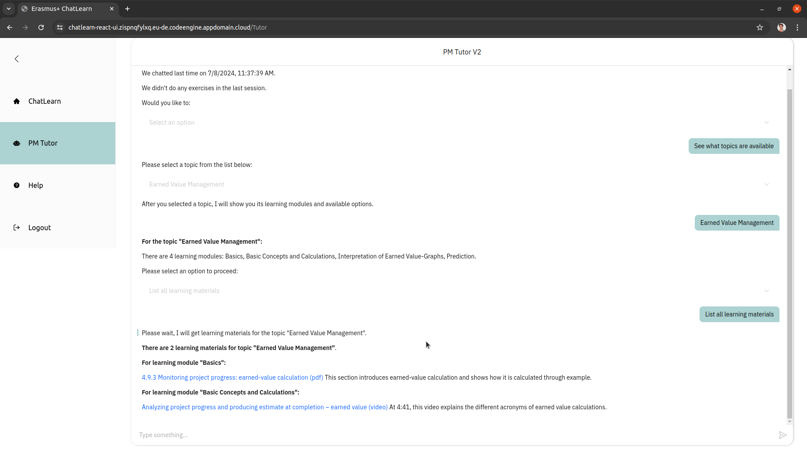

# PMTutor Cloud Object Storage: CSC Allas

## Introduction to CSC Allas
CSC, IT Center for Science is funded by Finnish state and higher education institutions, provides its stakeholders with
computing and data management services. Learn more about [CSC](https://csc.fi/en/about-us/what-csc/).

Allas is a cloud object storage service offered by CSC&mdash;it can be used to store any types of data, for example, pdf-files,
images, videos. Each stored object has a public URL. Data can be managed through web clients, Python scripts, or command line tools. 
Learn more about [Allas](https://docs.csc.fi/data/Allas/introduction/).

## Selection and usage of Allas service in the project
The project was able to leverage Allas since some project members are from Industrial Engineering and Management, 
Faculty of Technology at the University of Oulu. It is used to stored curated materials for PMTutor. After uploading materials to Allas, the
URLs of materials were used in spreadsheet configurations. As a result, PMTutor is able to present intended materials to 
its users such as listing the learning materials of a selected topic (see the screenshot below).

*PMTutor lists learning materials of a topic as hyperlinks with short descriptions*

## Organization of PMTutor cloud objects
Allas "Pseudo folder" feature was used for organizing PMTutor materials. Learn more about [Allas pseudo folder](https://docs.csc.fi/data/Allas/terms_and_concepts/#pseudo-folder).

The list below shows the design of PMTutor cloud object organization.
* "chatlearn" (name of the Allas container for the project)
  * "learning-topic-name-in-kebab-case", e.g., "earned-value-management"
    * "org-id", e.g., "uo"
      * "learning-materials"
        * PDF, image, or video file names
      * "supplement"
        * Image files for topic exercises
  * "case-studies"
    * "org-id"
      * "learning-material"
        * PDF, image, or video files used as part of case study content
      * "supplement"
        * Files used in case study assignments, e.g., PDF, image
  * "pm-tutor"
    * for tutorial videos and other utility files

As a result, a URL is created for each uploaded material with the following pattern:
"(Allas based URL)/chatlearn/(first-level pseudo-folder name)/(further pseudo-folder(s) depending on the designated location)/(file name)"

For example:

https://a3s.fi/swift/v1/AUTH_bdc38b1f0b274326adf929ac803c1ef6/chatlearn/earned-value-management/uo/learning-materials/project-business.pdf will
retrieve "project business"(a course book co-authored by one of the project members) in pdf format used as learning material in a PMTutor topic, Earned Value Management, 
configured by the members from University of Oulu.

Similarly, you can get a list of all PMTutor cloud objects from https://a3s.fi/swift/v1/AUTH_bdc38b1f0b274326adf929ac803c1ef6/chatlearn/

To understand how the objects were used in PMTutor learning content, please check out topic and case study configurations from [Erasmus+ ChatLearn Material Bank](https://drive.google.com/drive/folders/1u6GvKGGqeYbRgt4HwSUUCB6z1oYjGXxB).

Return to [Content layer: cloud object storage](../README.md#cloud-object-storage)
