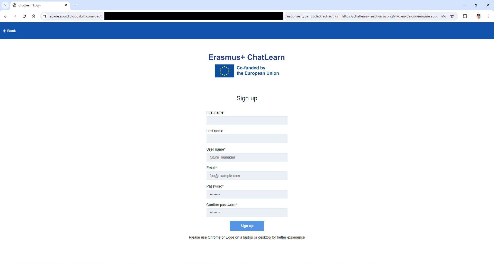

# PMTutor Authentication: IBM APP ID
IBM App ID provides a robust security framework that simplifies user authentication and authorization, ensuring 
that the target applications are protected from unauthorized access. By leveraging IBM App ID, developers can save significant 
time and effort in implementing and maintaining complex authentication systems, and focus on developing core application features.
Learn more about [IBM APP ID](https://www.ibm.com/products/app-id).

Jump to see [PMTutor APP ID in action](#app-id-in-action).

## PMTutor APP ID configuration
This section share the PMTutor APP ID configuration. To configure your PMTutor APP ID, please create the resource first.

### Use Cloud Directory with Username and Password Authentication
Cloud Directory with username and password authentication was selected to minimize personal information (only the username and a unique identifier) 
stored in PMTutor user databases. By using a username that does not reveal the real identity, it adds additional privacy
preservation while enabling personalized adaptive learning features.

1. Use Cloud Directory and disable other identity providers at APP ID > Manage Authentication > Identity providers.

2. Select the username and password option at APP ID > Cloud Directory > Settings.

### Specify APP ID redirect URLs
This setting enables client applications to use the APP ID service. The client URLs for development and production should be 
specified here.

App ID > Manage Authentication > Authentication Settings > Add web redirect URLs.

### Provide APP ID environment variables in the client application
Create dedicated service credentials in APP ID > Service Credentials and provide APP ID environment variable in the client application accordingly.

### Customize the login view (Optional)
You can add your project or organization logo, select a theme color, specify a header and footnote for your login view.

Got questions about how to use APP ID? Please consult [the APP ID documentation](https://cloud.ibm.com/docs/appid).

## APP ID in action
After configuring APP ID service and provided the APP ID API environment variables in the client application, users will be 
requested to log in when they navigate to the application.

*PMTutor login view*

A new user can sign up by providing a username that does not reveal their identity, an email address(mandatory when using APP ID), 
and a password, while leaving the first and last name fields empty. 

*PMTutor sign-up view*

After successfully signed up, a Cloud Directory account is created for the user and can be viewed by an authorized admin 
in APP ID > Manage Authentication > Cloud Directory > Users > (username).
Only the username and a unique identifier derived from the JSON web token of this user are stored in the PMTutor user databases.

*Cloud Directory user view*

Meanwhile, the user can start interacting with PMTutor after authentication!

*PMTutor chat view*

Return to [UI layer: authentication service](../README.md#authentication-service)

